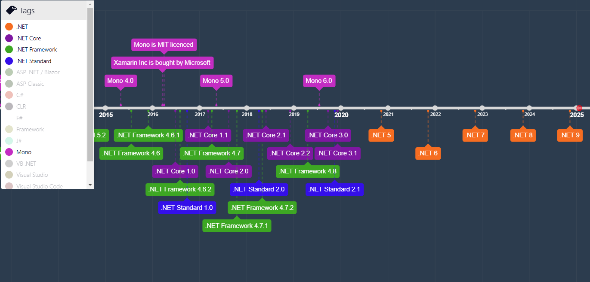

<!-- .slide: class="transition-bg-sfeir-2" -->
# .NET Core, Standard, Mono et .NET

##==##

<!-- .slide: class="two-column" data-background="#2c3c4e"-->

##--##

## Mono
- Alternative à .NET Framework 
  - **open-source**
  - **cross-platform**
  - développé par Novel, puis Xamarin et finalement racheté par Microsoft en 2016

##==##

<!-- .slide: class="two-column" data-background="#2c3c4e"-->

##--##

## .NET Core
- version **open-source** de .NET (CLR, CIL, Compilateur Roslyn) développé par Microsoft
- **cross-platform**
- réécriture complète !

##==##

<!-- .slide: class="two-column" data-background="#2c3c4e"-->

##--##

# .NET Standard
- **Spécification** des APIs .NET
- Implémentée par .NET Core, Mono, .NET Framework

##==##

<!-- .slide: class="two-column" data-background="#2c3c4e"-->

##--##

# .NET
- **UNIQUE**, plus de .NET Framework, .NET Standard, .NET Core ou Mono
- version et rythme de sortie clarifiés (LTS vs )

##==##

[https://versionsof.net/](https://versionsof.net/core/)
<iframe src="https://versionsof.net/" style="width: 100%; height: 80%; border: none;"></iframe>