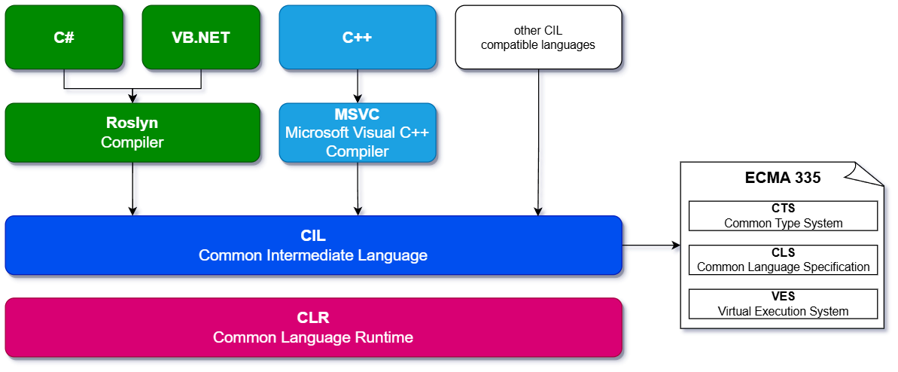

<!-- .slide: class="transition-bg-sfeir-2" -->
# .NET internal architecture

##==##

# .NET

##==##
<!-- .slide: class="two-column" -->

# CLR (Common Language Runtime)

- Type Safety
- Exception Handling
- Memory Management
- Garbage Collector
- Security
- Just-In-Time Compiler
- Thread Management
- Debugging

##--##
    

