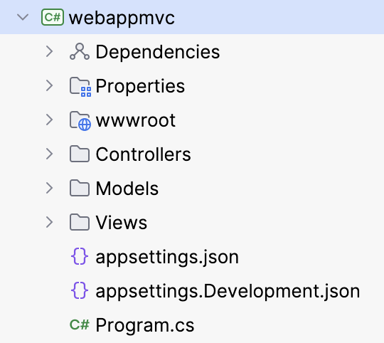

<!-- .slide: class="exercice" -->

# Explorons ensemble:

1. `Visual Studio Installer`
2. `Template` de création de projet
3. `Intermediate Language` avec [Rider](https://www.jetbrains.com/help/rider/Viewing_Intermediate_Language.html) ou l'extension VisualStudio [ILSpy](https://marketplace.visualstudio.com/items?itemName=SharpDevelopTeam.ILSpy2022)
<!-- .element: class="list-fragment" -->

##==##

# donet CLI

Les commandes les plus utilisées:
- `dotnet new`
- `dotnet restore`
- `dotnet build`
- `dotnet test`
- `dotnet run`
- `dotnet publish`
- `dotnet pack`

Executer les commandes suivantes (pour plus tard):
- **`dotnet tool list --global`**
- **`dotnet tool install dotnet-ef --global`**

##==##

# Contenu du template ASP.Net MVC

