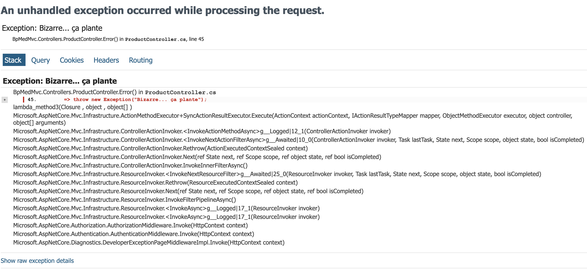

# Middleware

- Interception d'une requête HTTP pour effectuer des opérations **avant** et **après**.
- Exemple **avant** : gestion des erreurs.
    - En `Development`, regarder dans le fichier `Properties/launchSettings.json` pour voir la valeur de l'environnement
        ```json[1-11|7-9]
        "profiles": {
            "http": {
                "commandName": "Project",
                "dotnetRunMessages": true,
                "launchBrowser": true,
                "applicationUrl": "http://localhost:5077",
                "environmentVariables": {
                    "ASPNETCORE_ENVIRONMENT": "Development"
                }
            }
        }
        ```
<!-- .element: class="list-fragment" -->

##==##

# Developer Exception Page



##==##

# Production Exception Page

```csharp
var app = builder.Build();

//...

if (!app.Environment.IsDevelopment())
{
    app.UseExceptionHandler("/Home/Error");

}
```

Permet: 
- Afficher uniquement les informations à destination de l'utilisateur
    - **Adapter** la culture (langue) 
    - Proposer de **contacter** le support (ou de créer un ticket qqpart)
    - **Suggérer des actions** à l'utilisateur
    - "Jolie" page d'erreur
<!-- .element: class="list-fragment" -->

##==##

Comment intercepter cette exception pour la logger avant de faire l'affichage à l'utilisateur ?
<!-- .element: class="admonition question" -->

```csharp
// 1. Ajouter une classe qui hérite de IExceptionHandler
public class ExceptionHandler(ILogger<ExceptionHandler> logger) : IExceptionHandler
{
    public ValueTask<bool> TryHandleAsync(HttpContext httpContext, Exception exception, CancellationToken cancellationToken)
    {
        logger.LogError(exception, "Unhandled exception");
        return ValueTask.FromResult(false);
    }
}
````

```csharp
// 2. Ajouter le middleware dans Program.cs
builder.Services.AddExceptionHandler<ExceptionHandler>();
```

##==##

# Exercice
<!-- .slide: class="exercice" -->

- Mettre en place un IExceptionHandler qui logge les exceptions non gérées
- Changer la variable d'environnement `ASPNETCORE_ENVIRONMENT` de `Development` à `Production` dans `Properties/launchSettings.json` et observer le comportement
